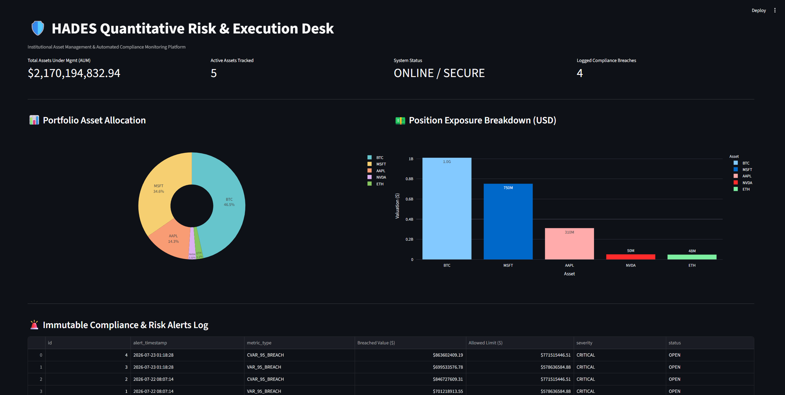

# 🛡️ HADES Quantitative Risk & Execution Engine


An institutional-grade portfolio risk engine built in Python and PostgreSQL. Features vectorized **10,000-path Monte Carlo simulations**, **95% VaR & CVaR risk bounds**, **automated compliance limit sentinels**, **algorithmic position rebalancing**, **historical Black Swan stress testing**, and a live **executive visual dashboard**.

---

## 🖥️ Executive Command Center



> **Key Metrics Monitored:** Real-time Assets Under Management (AUM), position exposure breakdowns, active asset tracking, system security state, and an append-only audit trail of compliance limit breaches.

---

## ✨ System Features

* 📊 **Executive Visual Dashboard:** Real-time Streamlit and Plotly UI displaying asset weights, exposure distributions, and active audit tickets.
* 🎲 **Monte Carlo Risk Engine:** Vectorized 30-day Geometric Brownian Motion (GBM) simulation running 10,000 parallel paths to compute 95% Value at Risk (VaR) and Conditional Value at Risk (CVaR).
* 🚨 **Automated Risk Sentinel:** Continuous limit breach monitor that automatically flags 15% VaR and 20% CVaR threshold violations.
* 🛡️ **Immutable Database Ledger:** Asynchronous PostgreSQL backend maintaining append-only transaction logs (`portfolio_transactions`) and permanent audit records (`risk_alerts`).
* ⚖️ **Algorithmic Rebalancing Desk:** Order execution desk calculating exact sell quantities to force over-concentrated volatile assets (e.g. BTC) back underneath institutional risk caps.
* 💥 **Black Swan Stress Tester:** Macro crisis simulator evaluating portfolio resilience against historical shocks (2008 Financial Crisis, March 2020 COVID Liquidity Squeeze, and 2022 Crypto Contagion).
* 📡 **Live Market Data Pipe:** Asynchronous feed pipeline simulating real-time WebSocket price updates.

---

## 📐 Mathematical & Quantitative Framework

### 1. Geometric Brownian Motion (GBM)
Asset price paths are modeled via stochastic differential equations:

$$dS_t = \mu S_t dt + \sigma S_t dW_t$$

Where:
* $S_t$ = Asset price at time $t$
* $\mu$ = Expected drift (historical return)
* $\sigma$ = Asset volatility
* $dW_t$ = Wiener process noise term $\sim \mathcal{N}(0, dt)$

### 2. Value at Risk (VaR) & Conditional VaR (CVaR)
* **95% VaR:** The 5th percentile worst-case loss threshold over a 30-day horizon:
  $$\text{VaR}_{\alpha}(X) = -\inf \{ x \in \mathbb{R} : P(X \le x) > 1 - \alpha \}$$
* **95% CVaR (Expected Shortfall):** The expected loss given that the loss exceeds the VaR threshold:
  $$\text{CVaR}_{\alpha}(X) = \mathbb{E}[-X \mid -X \ge \text{VaR}_{\alpha}(X)]$$

---

## 🏗️ System Architecture & Stack

| Component | Technology | Description |
| :--- | :--- | :--- |
| **Database Ledger** | PostgreSQL (`psycopg3`) | Async append-only transaction & alert ledger |
| **Quant Engine** | NumPy, Pandas, SciPy | 10,000-path vectorized stochastic simulator |
| **Compliance Audit** | Python AsyncIO | Sentinel service tracking 15% VaR & 20% CVaR limits |
| **Execution Desk** | Custom Quant Script | Automated order desk calculating target weight trims |
| **Frontend UI** | Streamlit, Plotly | Interactive web UI with real-time portfolio charts |

---

## 📁 Repository Structure

```text
hades-engine/
├── assets/
│   └── dashboard.png               # Dashboard screenshot for README
├── compliance/
│   └── risk_sentinel.py            # Automated limit breach auditor
├── dashboard/
│   └── app.py                      # Streamlit executive visual interface
├── data_stream/
│   └── live_stream.py              # WebSocket market feed simulator
├── database/
│   ├── execute_rebalance.py        # Order execution desk
│   ├── rebalance_portfolio.py      # Quantitative rebalance calculator
│   └── init_db.py                  # PostgreSQL schema setup
├── quant_engine/
│   ├── monte_carlo_engine.py       # 10,000-path VaR/CVaR simulator
│   └── stress_tester.py            # Historical Black Swan crash suite
├── .gitignore                      # Git ignore rules
├── README.md                       # Project documentation
└── requirements.txt                # Python dependencies
