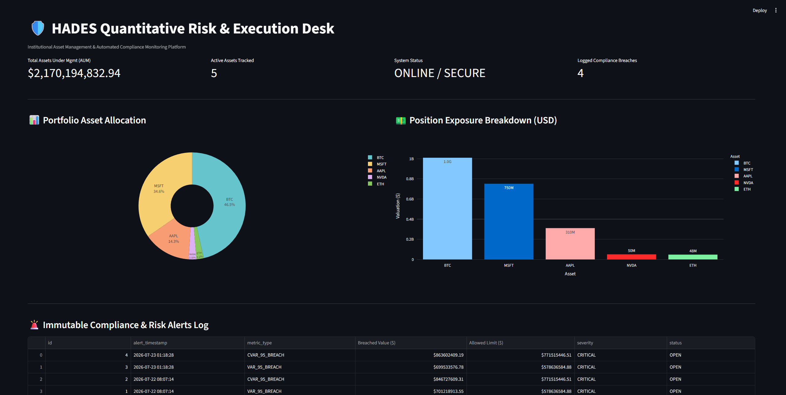

# 🛡️ HADES Quantitative Risk & Execution Engine


An institutional-grade portfolio risk engine built in Python and PostgreSQL. Features vectorized **10,000-path Monte Carlo simulations**, **95% VaR & CVaR risk bounds**, **real historical market data ingestion (yfinance)**, **automated compliance limit sentinels**, **historical Black Swan stress testing**, and an interactive executive visual dashboard.

---

## 🖥️ Executive Command Center



> **Key Metrics Monitored:** Real-time Assets Under Management (AUM), position exposure breakdowns, active asset tracking, system security state, and an append-only audit trail of compliance limit breaches.

---

## ✨ System Features

* 🚀 **End-to-End Pipeline Orchestrator (`main.py`):** Unified execution loop running data ingestion, Monte Carlo risk modeling, Black Swan stress testing, and compliance auditing in under 3 seconds.
* 📈 **Real Market Data Pipeline:** Live yfinance integration seeding 1+ years of historical adjusted closing prices into PostgreSQL.
* 🎲 **Monte Carlo Risk Engine:** Vectorized 30-day Geometric Brownian Motion (GBM) simulation running 10,000 parallel paths to compute 95% Value at Risk (VaR) and Conditional Value at Risk (CVaR).
* 🛡️ **Automated Risk Sentinel:** Continuous compliance monitor flagging **-5.0% VaR** and **-8.0% CVaR** limit breaches and persisting critical alerts directly to PostgreSQL `risk_alerts`.
* 🌋 **Black Swan Stress Tester:** Macro crisis simulator evaluating portfolio resilience against historical market shocks (2008 Global Financial Crisis, March 2020 COVID Liquidity Shock, 2022 Crypto Contagion, and Macro Squeezes).
* ⚖️ **Algorithmic Rebalancing Desk:** Order execution engine calculating exact sell quantities to trim over-concentrated positions back underneath target caps.
* 📊 **Executive Visual Dashboard:** Real-time Streamlit and Plotly UI displaying asset allocations, exposure distributions, and active risk tickets.

---

## 📐 Mathematical & Quantitative Framework

### 1. Geometric Brownian Motion (GBM)
Asset price paths are modeled via stochastic differential equations:

$$dS_t = \mu S_t dt + \sigma S_t dW_t$$

Where:
* $S_t$ = Asset price at time $t$
* $\mu$ = Expected drift (annualized return)
* $\sigma$ = Asset volatility (annualized standard deviation)
* $dW_t$ = Wiener process noise term $\sim \mathcal{N}(0, dt)$

### 2. Value at Risk (VaR) & Conditional VaR (CVaR)
* **95% 30-Day VaR:** The 5th percentile worst-case loss threshold over a 30-day horizon:

$$\text{VaR}_{\alpha}(X) = -\inf \{ x \in \mathbb{R} : P(X \le x) > 1 - \alpha \}$$

* **95% 30-Day CVaR (Expected Shortfall):** The expected loss given that the loss exceeds the VaR threshold:

$$\text{CVaR}_{\alpha}(X) = \mathbb{E}[-X \mid -X \ge \text{VaR}_{\alpha}(X)]$$

---

## 🏗️ System Architecture & Stack

| Component | Technology | Description |
| :--- | :--- | :--- |
| **Orchestrator** | Python AsyncIO | Unified 4-stage automated execution pipeline (`main.py`) |
| **Database Ledger** | PostgreSQL (`psycopg3`) | Async append-only transaction, price, and alert ledger |
| **Quant Engine** | NumPy, Pandas, SciPy | 10,000-path vectorized stochastic simulation engine |
| **Compliance Audit** | Python AsyncIO | Sentinel service tracking -5.0% VaR & -8.0% CVaR limits |
| **Market Ingestion** | `yfinance` | Historical market price sync and seeding service |
| **Frontend UI** | Streamlit, Plotly | Interactive web interface with real-time portfolio charts |
| **Testing Suite** | `pytest` | Unit tests validating quantitative and database routines |

---

## 📁 Repository Structure

```text
hades-engine/
├── assets/
│   └── dashboard.png               # Dashboard UI screenshot for README
├── compliance/
│   └── risk_sentinel.py            # Automated limit breach auditor & PostgreSQL logger
├── dashboard/
│   └── app.py                      # Streamlit executive visual interface
├── data_stream/
│   └── live_stream.py              # Async price updates
├── database/
│   ├── execute_rebalance.py        # Trade execution desk
│   ├── init_db.py                  # PostgreSQL schema setup script
│   ├── rebalance_portfolio.py      # Portfolio target rebalancing calculator
│   └── seed_historical_prices.py   # Historical market data fetcher & DB seeder
├── ingestion/
│   └── stream_simulator.py         # Real-time ticker price stream simulator
├── quant_engine/
│   ├── calculate_metrics.py        # Portfolio return & exposure calculations
│   ├── monte_carlo_engine.py       # 10,000-path VaR/CVaR simulator
│   └── stress_tester.py            # Historical Black Swan crash suite
├── tests/
│   └── test_quant_engine.py        # Pytest unit testing suite
├── .env.example                    # Template environment variables file
├── .gitignore                      # Git ignore rules
├── config.py                       # Centralized DB and logging configuration
├── main.py                         # Master automated pipeline orchestrator
├── README.md                       # System documentation
└── requirements.txt                # Python package dependencies
git clone [https://github.com/intheperkofextinction/hades-engine.git](https://github.com/intheperkofextinction/hades-engine.git)
cd hades-engine
python3 -m venv venv
source venv/bin/activate
pip install -r requirements.txt
cp .env.example .env
python database/init_db.py
python main.py
streamlit run dashboard/app.py
